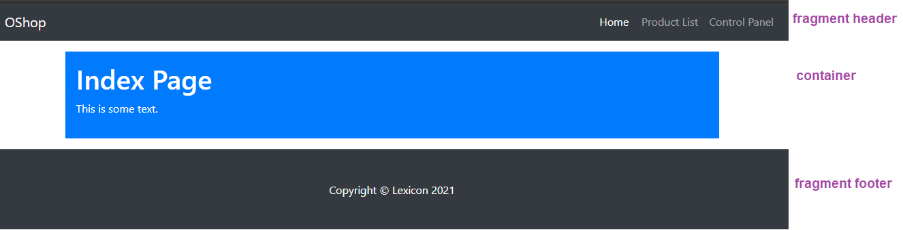
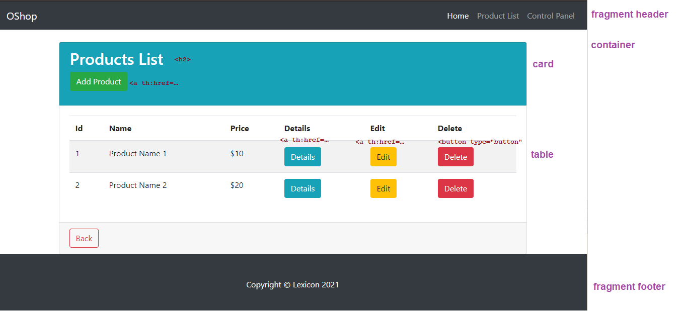
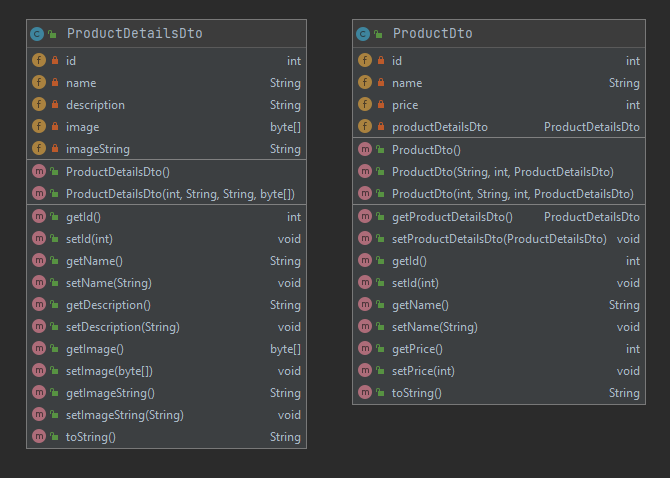

# Spring Boot MVC Thymeleaf

## Project Dependencies

- dev-tools
- web
- thymeleaf
- jpa-data
- mysql
- h2
- **bootstrap dependencies**

```xml

<dependencies>
    <!-- other dependencies -->

    <!-- bootstrap dependencies -->
    <dependency>
        <groupId>org.webjars</groupId>
        <artifactId>bootstrap</artifactId>
        <version>4.5.0</version>
    </dependency>

    <dependency>
        <groupId>org.webjars</groupId>
        <artifactId>webjars-locator</artifactId>
        <version>0.40</version>
    </dependency>

</dependencies>
```

#### Create HTML pages

1.index.html
   
   


2.productManagement.html
   
   

#### Create DTO Classes

3.ProductDTO + ProductDTODetails
   
   

### Create Controller Classes

4.HomeController

```java

@Controller
public class HomeController {

    @GetMapping("/")
    public String index() {
        return "index";
    }

}
```

5.ProductManagementController

```java

@RequestMapping("/admin/product")
public class ProductManagementController {

    private List<ProductDto> productDtoList;

    @PostConstruct
    public void init() {
        // instantiate array list
        // instantiate ProductDto object
        // add ProductDto to array list
    }

    @GetMapping("/")
    public String getAllProducts(Model model) {
        model.addAttribute("productDtoList", productDtoList);
        return "productManagement";
    }

}
```


### Links

6.All links should work correctly

   
   - Home link should redirect to index page
   - Control panel link should redirect to productManagement page
